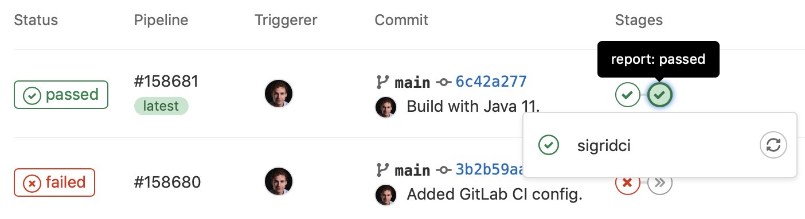

Integrating Sigrid CI into your continuous integration pipeline
===============================================================

This guide explains how to integrate Sigrid into your continuous integration pipeline. Make sure you have also read the [general Sigrid CI documentation](README.md) before starting this guide. This document describes a generic integration, but the aforementioned page also contains some specific instructions for integrating Sigrid CI with commonly used development platforms.

## Prerequisites

- You have a Sigrid user account. 
- [Python 3.7 or higher](https://www.python.org) needs to be available in the CI environment. The client scripts for Sigrid CI are based on Python.

## Request a Sigrid CI account

The account you use to submit code to Sigrid CI is different from your normal Sigrid user account. The account consists of an account name and a token, which you add to your CI environment's configuration in the next step. 

You can obtain a Sigrid CI account by requesting one from [support@softwareimprovementgroup.com](mailto:support@softwareimprovementgroup.com). Support for creating Sigrid CI accounts yourself will be added in a future version.

Once the account has been created, you can use Sigrid's user management feature to control which systems it is allowed to access. Similar to normal Sigrid user accounts, Sigrid CI accounts can either serve a specific system, a group of systems, or all systems in your portfolio.

## On-boarding your system to Sigrid

On-boarding is done automatically when you first run Sigrid CI. As long as you have a valid token, and that token is authorized to on-board systems, you will receive the message *system has been on-boarded to Sigrid*. Subsequent runs will then be visible in both your CI environment and [sigrid-says.com](https://sigrid-says.com). 

## Configuration

**Step 1: Configure Sigrid credentials to environment variables**

Sigrid CI reads your Sigrid account credentials from two environment variables, called `SIGRID_CI_ACCOUNT` and `SIGRID_CI_TOKEN`. You can either define these environment variables in the CI user's `~/.bashrc`, though some platforms also allow you to define environment variables using a graphical interface.

The following example shows an example of the environment variables being added to `~/.bashrc`:

```
# Leave existing contents of the file as they were, and add these lines
export SIGRID_CI_ACCOUNT="j.doe+ci@example.com"
export SIGRID_CI_TOKEN="EHHtLKgPQH3XfjNZfmKqABUR"
```

**Step 2: Download the Sigrid CI client scripts and make them available to your Sigrid CI environment**

Sigrid CI consists of a number of Python-based client scripts, that interact with Sigrid in order to analyze your project's source code and provide feedback based on the results. These client scripts need to be available to the CI environment, in order to call the scripts *from* the CI pipeline. 

The scripts can be obtained by either cloning or downloading this repository, and moving the `sigridci` directory to a location that is available to the CI environment.

**Step 3: Add Sigrid CI to your project's CI pipeline**

Next, you need to edit your project's CI configuration, in order to add Sigrid CI as an extra step. The exact location and syntax of the CI configuration will depend on the platform you're using, but in general the CI configuration consists of shell script invocations that are organized into separate steps. 

The following example shows a GitLab CI configuration file for a Java-based project, with Sigrid CI added as the last step:

```
stages:  
- build  
- test  
- report

compile:   
  stage: build   
  script:    
    - mvn clean compile
    
unittests:   
  stage: test   
  script:
    - mvn test surefire-report:report

sigridci:
  stage: report
  script:
    - git clone https://github.com/Software-Improvement-Group/sigridci.git sigridci
    - ./sigridci/sigridci/sigridci.py --customer examplecustomername --system examplesystemname --source . --targetquality 3.5
  allow_failure: true
  artifacts:
    paths:
      - "sigrid-ci-output/*"
    expire_in: 1 week
    when: always
  except:
    - master
    
sigridpublish:
  stage: report
  script:
    - git clone https://github.com/Software-Improvement-Group/sigridci.git sigridci
    - ./sigridci/sigridci/sigridci.py --customer examplecustomername --system examplesystemname --source . --targetquality 3.5 --publish
  allow_failure: true
  only:
    - master
```

This configures two additional build steps:

- The `sigridci` step provides Sigrid feedback for pull request. This step is configured to run for every branch *except* the main/master branch.
- The `sigridpublish` step publishes project snapshots to [sigrid-says.com](https://sigrid-says.com). This step only runs for the main/master branch.

**Security note:** This example downloads the Sigrid CI client scripts directly from GitHub. That might be acceptable for some projects, and is in fact increasingly common. However, some projects might not allow this as part of their security policy. In those cases, you can simply download the `sigridci` directory in this repository, and make it available to your runners (either by placing the scripts in a known location, or packaging them into a Docker container). 

The relevant command that starts Sigrid CI is the call to the `sigridci.py` script, which starts the Sigrid CI analysis. The scripts supports a number of arguments that you can use to configure your Sigrid CI run. The scripts and its command line interface are explained in [using the Sigrid CI client script](client-script-usage.md).

Finally, note that you need to perform this step for every project where you wish to use Sigrid CI. Be aware that you can set a project-specific target quality, you don't necessarily have to use the same target for every project.

## Usage

Once you have configured the integration, Sigrid CI will show up as a new step in your CI pipeline. The step will succeed if the code quality meets the specified target, and will fail otherwise. 



Sigrid CI provides multiple levels of feedback. The first and fastest type of feedback is directly produced in the CI output, as shown in the following screenshot:


The output consists of the following:

- A list of refactoring candidates that were introduced in your merge request. This allows you to understand what quality issues you caused, which in turn allows you to fix them quickly. Note that quality is obviously important, but you are not expected to always fix every single issue. As long as you meet the target, it's fine.
- An overview of all ratings, compared against the system as a whole. This allows you to check if your changes improved the system, or accidentally made things worse.
- The final conclusion on whether your changes and merge request meet the quality target.

In addition to the textual output, Sigrid CI also generates a static HTML file that shows the results in a more graphical form. This is similar to test coverage tools, which also tend to produce a HTML report. The information in the HTML report is based on the aforementioned list, though it includes slightly more detail.


Finally, if you want to have more information on the system as a whole, you can also access [Sigrid](http://sigrid-says.com/), which gives you more information on the overall quality of the system, its architecture, and more.

## Contact and support

Feel free to contact [SIG's support department](mailto:support@softwareimprovementgroup.com) for any questions or issues you may have after reading this document, or when using Sigrid or Sigrid CI. Users in Europe can also contact us by phone at +31 20 314 0953.
