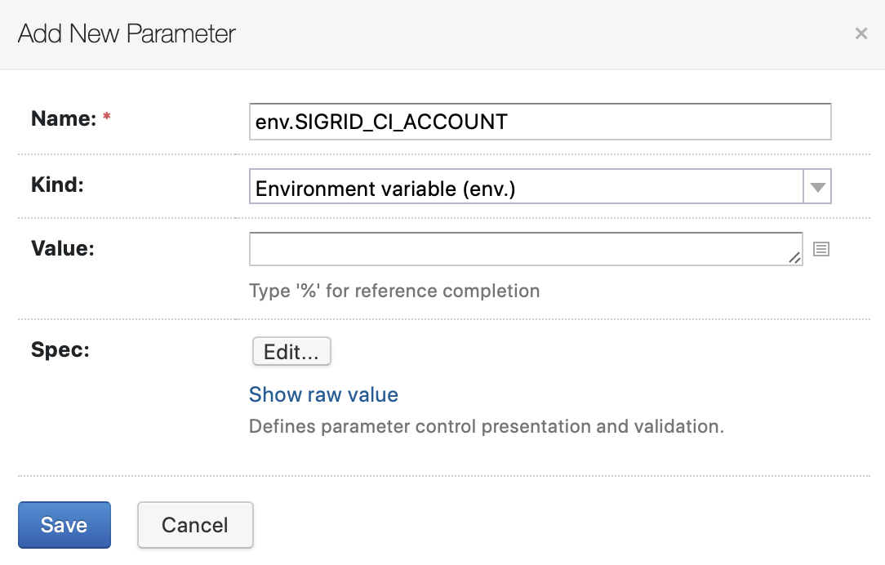
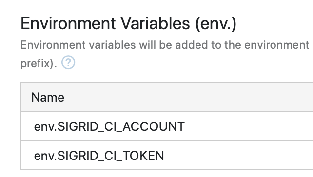

Integrating Sigrid CI with TeamCity
===================================

This guide explains how to integrate Sigrid into your TeamCity continuous integration pipeline. Make sure you have also read the [general Sigrid CI documentation](README.md) before starting this guide.

## Prerequisites

- You have a [Sigrid](https://sigrid-says.com) user account. 
- You have created an [authentication token for using Sigrid CI](authentication-tokens.md).
- [Python 3.7 or higher](https://www.python.org) needs to be available in the CI environment. The client scripts for Sigrid CI are based on Python.

## On-boarding your system to Sigrid

On-boarding is done automatically when you first run Sigrid CI. As long as you have a valid token, and that token is authorized to on-board systems, you will receive the message *system has been on-boarded to Sigrid*. Subsequent runs will then be visible in both your CI environment and [sigrid-says.com](https://sigrid-says.com). 

## Configuration

This documentation assumes you have already created a project in TeamCity, and that your project is connected to a Git repository. 

### Step 1: Create build step

You can add Sigrid CI to your TeamCity project by creating a new build step:

- Select your TeamCity project
- Select build steps from the menu on the left
- Click the "add build step" button
- When asked for the runner type, select "command line"
- For the run type, select "custom script"
- You can now enter the following script:

```
git clone https://github.com/Software-Improvement-Group/sigridci.git sigridci
./sigridci/sigridci/sigridci.py --customer yourcustomername --system yoursystemname --source . --targetquality 3.5
```

This scripts supports a number of arguments that you can use to configure your Sigrid CI run. The scripts and its command line interface are explained in [using the Sigrid CI client script](client-script-usage.md).

**Security note:** This example downloads the Sigrid CI client scripts directly from GitHub. That might be acceptable for some projects, and is in fact increasingly common. However, some projects might not allow this as part of their security policy. In those cases, you can simply download the `sigridci` directory in this repository, and make it available to your runners.

- For "artifact paths", enter the value `**/sigrid-ci-output/**`.
- In "Docker settings", use `python:3.9-buster` as the container name and "Docker image platform" to "Linux". Note that using this Docker container is just an example, custom Docker containers or custom runners are also supported, as long as the runner meets the system requirements listed in the "Prerequisites" section at the top of this page.

After performing these steps you should end up with the following configuration:


### Step 2: Configure account credentials

Now that we have created the new build step, we need to provide our [Sigrid authentication token](authentication-tokens.md):

- Select "parameters" in the build menu on the left.
- Click "add new parameter"
- Add an environment variable with the kind "environment variable", the name `env.SIGRID_CI_TOKEN`, and your token as the value.



- Save the environment variable



### Step 3: Run your pipeline

After completing the previous two steps, Sigrid CI will now run as part of your pipeline. To test the pipeline, you can either wait until it's triggered or trigger it manually using the "run" button in the TeamCity web interface.

After the pipeline has completed, Sigrid CI will be shown as part of the normal build output. The check will succeed if the code quality meets the specified target, and will fail otherwise. 


## Usage

In addition to the simple success/failure indicator, Sigrid CI provides multiple levels of feedback. To obtain feedback on your commit, click on the "Sigrid CI" step in the pipeline results screen:


The output consists of the following:

- A list of refactoring candidates that were introduced in your merge request. This allows you to understand what quality issues you caused, which in turn allows you to fix them quickly. Note that quality is obviously important, but you are not expected to always fix every single issue. As long as you meet the target, it's fine.
- An overview of all ratings, compared against the system as a whole. This allows you to check if your changes improved the system, or accidentally made things worse.
- The final conclusion on whether your changes and merge request meet the quality target.

In addition to the textual output, Sigrid CI also generates a static HTML file that shows the results in a more graphical form. This is similar to test coverage tools, which also tend to produce a HTML report. You can access this report from the "artifacts" section in your build output:


The information in the HTML report is based on the aforementioned list, though it includes slightly more detail.


Finally, if you want to have more information on the system as a whole, you can also access [Sigrid](http://sigrid-says.com/), which gives you more information on the overall quality of the system, its architecture, and more.

## Contact and support

Feel free to contact [SIG's support department](mailto:support@softwareimprovementgroup.com) for any questions or issues you may have after reading this document, or when using Sigrid or Sigrid CI. Users in Europe can also contact us by phone at +31 20 314 0953.
